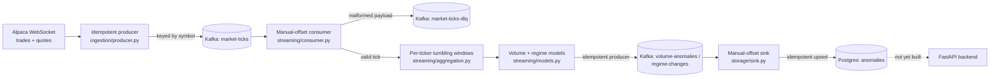

# StreamAlpha — Real-Time Market Anomaly Detection via Kafka

Real-time market anomaly detection via Kafka. Online/streaming ML (incremental isolation forest, Bayesian changepoint detection) flags volume spikes and volatility regime shifts, built around an explicit exactly-once processing story. Extends [alpha-signal-lab](https://github.com/hkbuttar/alpha-signal-lab)'s equity universe with a true event-streaming architecture in place of that project's daily batch loop.

> **Status**: In progress. Ingestion, consumer correctness (manual offsets, DLQ routing and replay), online anomaly detection (volume spikes, volatility regime changes), the idempotent Postgres sink, and a cross-reference analysis against alpha-signal-lab's own factors are built and verified against a live Alpaca paper account, a local Kafka broker, and a local Postgres. The exactly-once story (idempotent producer → manual offset commit → idempotent sink) is complete end to end. Backend, chaos testing, and deployment are not yet built — see [Current Status](#current-status) for what's real versus what's planned.

---

## Table of Contents
1. [Motivation](#motivation)
2. [System Architecture](#system-architecture)
3. [Data](#data)
4. [Correctness Design](#correctness-design)
5. [Online Anomaly Detection](#online-anomaly-detection)
6. [Cross-Reference Analysis](#cross-reference-analysis)
7. [Repository Structure](#repository-structure)
8. [Setup & Usage](#setup--usage)
9. [Current Status](#current-status)
10. [Future Work](#future-work)

---

## Motivation

[alpha-signal-lab](https://github.com/hkbuttar/alpha-signal-lab) is a daily-batch factor research and paper-trading platform: it pulls end-of-day bars, scores signals once a day, and rebalances on that cadence. That's the right cadence for a slow-moving factor strategy, but it can't see anything that happens *within* a day — a volume spike, a sudden volatility regime shift, a quote that's gone stale — because by the time the next batch run picks up the data, the moment that mattered is long past.

StreamAlpha asks a narrower, different question against the same universe: can genuinely real-time, tick-by-tick data support anomaly detection that has to update online, one event at a time, with no batch window to fall back on? That constraint changes almost everything about the engineering, not just the modeling: ingestion has to handle a WebSocket that can drop mid-stream, a consumer has to survive a crash without silently losing or duplicating a tick, and the ML models (once built) have to update incrementally instead of retraining from a stable historical window. This project is the event-streaming counterpart to alpha-signal-lab's batch pipeline, sharing its universe but built around a completely different set of correctness problems.

---

## System Architecture



Solid boxes and arrows are built and verified; dashed ones are planned (see [Current Status](#current-status)). Every stage that exists is a separate module so ingestion, consumption, and (eventually) modeling can be tested and reasoned about independently.

---

## Data

- **Universe**: the same equity universe as alpha-signal-lab, imported directly from `config.universe` (see [Correctness Design](#correctness-design) for how) rather than copied — 50 large-cap US names across Technology, Healthcare, Financials, and Energy. (alpha-signal-lab's own README describes this as a 49-name universe after dropping Hess post-acquisition; the `config/universe.py` file actually installed and imported here currently contains 50 tickers with no Hess entry, so that number is stated as observed rather than reconciled against alpha-signal-lab's docs.)
- **Feed**: Alpaca's real-time WebSocket (`wss://stream.data.alpaca.markets/v2/iex`), trades and quotes, not the REST API — a REST poll can't see intra-second activity, which is the whole reason this project exists alongside alpha-signal-lab's batch pipeline.
- **Feed tier caveat, found empirically**: Alpaca does not publish the free/IEX plan's maximum simultaneous symbol subscription count anywhere in its docs (checked the streaming docs, market data FAQ, and pricing page directly). Subscribing to too many symbols at once fails with `symbol limit exceeded (405)`. Confirmed against a real account: 30 symbols fails, 15 succeeds; the exact ceiling in between hasn't been pinned down further since it isn't needed to be precise, just under the real limit. `ALPACA_MAX_SYMBOLS` in `.env` controls how many of the 50 universe tickers get subscribed, so this is tunable per account rather than hardcoded.
- **No historical backfill**: unlike alpha-signal-lab, there's no cached local dataset here — every tick is either live from the WebSocket or replayed from Kafka/the DLQ. A gap in the WebSocket connection is a real, permanent data gap (see below), not something a re-download can fix later.

---

## Correctness Design

Exactly-once processing is treated as a deliberate design decision made of three independent legs, not a single setting to turn on. All three are now built:

**1. Idempotent producer (`ingestion/producer.py`, `streaming/anomaly_producer.py`).** `enable.idempotence=true` plus `acks=all` means librdkafka tags every message with a producer ID and a per-partition sequence number, so a retried send after a broker timeout or leader failover is recognized and deduplicated by the broker rather than appended twice. This only protects against *producer-side retries* — it says nothing about a consumer reprocessing a message after a crash, which is the next leg.

**2. Manual offset commit + dead-letter queue (`streaming/consumer.py`, `streaming/dlq.py`, `storage/sink.py`).** Auto-commit is disabled everywhere in this pipeline. An offset is committed only after whatever that message required is durably done — the tick was handed to a processing callback, a malformed payload was durably written to `market-ticks-dlq`, or (for the storage sink) an anomaly event was durably upserted into Postgres. Two distinct failure categories are handled two different ways on purpose:
  - A payload that fails schema validation (`streaming/schema.py`) is bad data, not a bug in the consumer — it's routed to the DLQ instead of crashing the process or being silently dropped, with `streaming/dlq_tools.py` available to inspect and replay those records once the upstream issue is fixed. `storage/sink.py` deliberately has no DLQ of its own: its input topics are produced entirely by this project's own code, so a malformed payload there means a bug in *this* project, not upstream data drift — see `storage/schema.py`'s module docstring.
  - An exception raised by the processing callback itself is treated as a real bug, not bad data, and is deliberately **not** caught: it propagates and crashes the consumer, leaving the offset uncommitted so the same message is redelivered and reprocessed on restart. Catching and swallowing it here would trade that guarantee away for uptime, silently.

**3. Idempotent storage sink (`storage/db.py`, `storage/sink.py`).** A single `anomalies` table holds both volume anomalies and regime changes (type-specific fields live in a JSONB `details` column, the same pattern alpha-signal-lab's own `portfolio_snapshots.positions_json` uses for similarly flexible data), with a `UNIQUE (ticker, window_start, anomaly_type)` constraint and an `ON CONFLICT ... DO UPDATE` upsert. Verified live, not just by inspection: produced synthetic events to Kafka, ran the sink, confirmed 2 rows in Postgres; reset the consumer group's offsets to earliest to force full redelivery of the same messages, reran the sink, and confirmed the row count stayed at 2 with the original `detected_at` timestamp preserved (only `details` refreshed) — real redelivery through Kafka, not a direct call to the upsert function.

**Cross-repo dependency.** `config.universe` is imported from alpha-signal-lab as a live editable install (`-e ../alpha-signal-lab` in `requirements.txt`), not copied, so the two projects can't silently drift apart on what "the universe" means. This only works with both repos checked out as sibling directories locally; it will need to become a git dependency or a vendored copy once this is deployed somewhere that only clones streamalpha.

**Reconnect/backoff, found through real debugging rather than assumed.** alpaca-py's own WebSocket client retries a dropped connection with zero backoff, including on persistent auth failures — confirmed live against a real account, where a stale connection from a killed test process caused a `connection limit exceeded` error that the SDK retried dozens of times in under a second. `ingestion/run.py` supervises the connection from a watchdog thread and applies its own exponential backoff. Getting the shutdown path right took three attempts: a plain blocking `thread.join()` silently swallowed `Ctrl+C` (confirmed by attaching `lldb` to a genuinely hung process), a polled version of the same `try`/`except KeyboardInterrupt` pattern still didn't reliably fire, and the version that actually works uses a custom `signal.signal()` handler setting a flag that's checked cooperatively — verified to respond within about 50ms where the exception-based approach had been observed hanging for 10+ seconds. This is covered by regression tests in `tests/ingestion/test_run.py` specifically because it looked fixed twice before it actually was.

**The same shutdown bug class, again, in a completely different C extension.** `streaming/consumer.py`'s `consumer.poll()` blocks inside librdkafka's C code even though it's called with a 1-second timeout — attaching `lldb` to a hung consumer process showed the main thread stuck in `cnd_timedwait_abs` well over a minute after `Ctrl+C`, the identical shape of the `ingestion/run.py` bug but in a totally unrelated library. That's no longer treated as a one-off: the rule adopted project-wide is that no blocking call into a C extension, timeout or not, can be trusted to let a pending signal through promptly, and every consume loop uses the same custom-`signal.signal()`-plus-cooperative-flag pattern instead of relying on `KeyboardInterrupt`.

**`streaming/dlq_tools.py`'s "when is a drain done" logic took three attempts, all caught live.** First: stop on the very first empty poll — wrong, `inspect` reported "0 records" against a topic `kafka-console-consumer` could read from immediately afterward, because a fresh consumer group's rebalance takes a few seconds and an empty poll during that window looks identical to no data. Second: require several consecutive empty polls before giving up — better, but still wrong on this topic's 3 partitions (`inspect` found 7 records while a `replay` run moments later found 20 more). Third attempt precomputed an exact count via `get_watermark_offsets` on the same consumer about to fetch from those partitions — this one didn't just under- or over-count, it got a real `replay` run stuck indefinitely one message from the end, a message independently confirmed present and readable the whole time. The actual fix was to stop reinventing exhaustion detection and use the Kafka client's own mechanism for it: `enable.partition.eof`, which makes `poll()` return a `PARTITION_EOF` pseudo-message exactly when a partition is drained. Re-verified live afterward: a `replay` run that had been stuck for minutes on the last message completed in 3.2 seconds once this landed.

**`storage/sink.py` duplicates `streaming/consumer.py`'s shutdown-signal pattern rather than sharing it.** By this point the same custom-`signal.signal()`-plus-flag fix had been derived twice from scratch, in two different C extensions, so copying the now-validated ~20 lines a third time was judged lower risk than refactoring two already-tested modules to share one helper mid-project. Noted here as reasonable future cleanup, not left silent.

**A real `pytest` bug, not a Kafka one, while adding `storage/`'s tests.** `tests/storage/test_schema.py` and the pre-existing `tests/streaming/test_schema.py` share a basename, and neither test directory has an `__init__.py` — pytest's import system collided on the two, failing collection entirely. The first fix tried, adding `__init__.py` to the test directories, made it worse: `tests/ingestion/__init__.py` turned `tests/ingestion` into a package literally named `ingestion`, which then shadowed the real top-level `ingestion` package for every `from ingestion import ...` in that directory's own tests. Reverted, and fixed the narrower way instead: renamed the one genuinely colliding file (`tests/storage/test_schema.py` → `test_anomaly_schema.py`), leaving the working `tests/ingestion/` and `tests/streaming/` layouts untouched.

**An empty-but-present env var caused a native C crash, not a Python exception.** A `.env` line like `STORAGE_CONSUMER_GROUP=` sets that variable to `""`, which is present, not absent — `os.environ.get(KEY, DEFAULT)`'s default only fires for a genuinely missing key, so every optional env var in this project reading via that pattern silently used `""` instead of its intended default whenever the `.env` line was left blank (the normal, expected state for an unconfigured optional var). Most of the time this just meant a wrong value; for `group.id` specifically it was much worse: constructing a real `confluent_kafka.Consumer` with `group.id=""` crashes with a native C assertion in `Consumer_init`, not a catchable Python exception — reproduced directly by constructing a bare `Consumer` with an empty `group.id` in isolation before touching any project code. Fixed everywhere this pattern appeared (`streaming/consumer.py`, `storage/sink.py`, `streaming/run_consumer.py`, `ingestion/alpaca_stream.py`) by switching to `os.environ.get(KEY) or DEFAULT`, which treats an empty value the same as a missing one.

---

## Online Anomaly Detection

Two separate models per ticker, deliberately not one: a volume spike is a single window looking unlike its recent history, a volatility regime shift is a sustained change in the *distribution* of returns. Conflating them into one detector would blur two different failure modes into one signal.

**Windowing (`streaming/aggregation.py`).** Trade ticks (not quotes — quotes are bid/ask book state, not a transaction) are aggregated into per-ticker tumbling windows, bounded by each trade's own timestamp rather than wall-clock arrival time, so replaying ticks later produces identical windows to processing them live. Each window closes with a trade volume total and a realized volatility figure (stdev of log returns within the window, `None` if fewer than 2 trades occurred).

**Volume spikes: `river`'s `HalfSpaceTrees`** (its streaming analogue of an isolation forest), scored per window. Its raw anomaly score turned out not to be a usable absolute cutoff — a synthetic 50x spike scored 0.994 against a 0.963 baseline in testing, not a clean separation. `river.anomaly.QuantileFilter` looked like the fix (an adaptive quantile threshold) but its `q` parameter had zero measurable effect across a 10x range (0.99 to 0.999) here, traced to `river.stats.Quantile`'s online P²-style estimator appearing to have resolution problems at extreme quantiles with only a few hundred samples — not well understood, and not something to build on without understanding why. What's used instead is a threshold owned directly in `streaming/models.py`: flag a score more than `k` standard deviations above an exponentially-weighted rolling mean/variance of recent scores (`k=3.0`, `fading_factor=0.05`, both swept empirically against synthetic spikes before settling).

**Volume detection: honest limitation, found by testing, not hidden.** An isolated single-window spike is detected unreliably: swept 10 random seeds against a 100x isolated spike with the shipped configuration and only 1-3/10 were detected. Tried reducing `HalfSpaceTrees`' tree height and feeding a volume-ratio feature instead of raw volume; neither meaningfully improved it. A sustained multi-window elevated-volume period showed the same weak recall (also 1/10). This is treated as a genuine characteristic of single-feature `HalfSpaceTrees` scoring on this kind of data — its scores compress toward a narrow high range for most points once the trees are built, regardless of magnitude — not a bug worth continuing to chase here. Richer features (recent volume trend, multiple lookback ratios) would likely help; that's future work. `tests/streaming/test_models.py` pins down what does and doesn't work with a fixed seed known to succeed, rather than asserting a reliability the model doesn't actually have.

**Volatility regime shifts: Bayesian online changepoint detection (`streaming/changepoint.py`), implemented from scratch** — `river` has no BOCPD implementation; its `drift` module (ADWIN, KSWIN, PageHinkley) is a different family of technique. This is the Adams & MacKay (2007) algorithm: a probability distribution over "run length" (time since the last regime change), updated via Normal-Gamma conjugate statistics and a Student-t predictive density, all in log-space (linear-space predictive probabilities underflow quickly).

Two real bugs surfaced while building and testing this against synthetic data with a known changepoint, not assumed correct from the derivation alone:
- The obvious changepoint signal, `P(run length = 0)`, turned out to be **mathematically constant** — exactly the hazard rate, independent of the data. Confirmed both algebraically (it falls out of how the changepoint and growth branches share the same total-evidence normalizer) and empirically (it never moved off `1/hazard_lambda` for any input tried, including a 20-sigma outlier). The actual signal used instead is `P(run length <= k)` for small `k`, which does respond to data — probability mass concentrates on "this run just started" right after a real shift.
- Realized volatility values are small in absolute terms (roughly 0.01–0.3 for short-window returns), while BOCPD's prior is implicitly scaled for data around magnitude 1. A clean 6x mean/variance shift in raw volatility went almost undetected (peak changepoint probability ~0.03) until the detector was fed `log(volatility)` instead, which is also the statistically conventional transform here regardless (volatility is positive and multiplicative, not a natural fit for a Normal model on its own) — detection went to ~0.96 on the same shift once fixed.

Verified live end-to-end, not just in unit tests: a synthetic sustained volume/price shift fed through the full running consumer produced a real `RegimeChange` event (`changepoint_probability=0.99`) published to `regime-changes`, confirmed via `kafka-console-consumer`.

**Model state persistence (`streaming/model_state.py`).** Each `TickerModels` instance (the `HalfSpaceTrees` pipeline and this project's own BOCPD state) is plain Python objects and pickles cleanly — confirmed by round-tripping trained state through `pickle.dumps`/`loads` before relying on it. State is saved periodically and on clean shutdown, written atomically (temp file + `os.replace`) so a crash mid-write can't corrupt the file for the next startup, and loaded back on startup — verified live: a second consumer run against the same state file logged `resumed model state for 1 ticker(s)` rather than starting cold.

**At-least-once, not exactly-once, for anomaly events specifically.** If a tick produces two anomaly events and publishing the second one fails, the first may already be durably published before the exception propagates and crashes the consumer (per the design in [Correctness Design](#correctness-design)) — a duplicate is possible on redelivery. This is fine: Kafka topics here carry at-least-once delivery, and true deduplication is the storage sink's job (`storage/db.py`'s upsert on ticker + window_start + anomaly type), which is what makes a duplicate publish harmless rather than something worth preventing at every intermediate hop.

---

## Cross-Reference Analysis

`analysis/cross_reference.py` is what makes "extends alpha-signal-lab" concrete rather than a shared universe in name only: for each anomaly streamalpha detects, did the same ticker also have an unusually large day-over-day move in one of alpha-signal-lab's own factors around the same date? It reuses alpha-signal-lab's actual factor computation (`factors/momentum.py`, `volatility.py`, `mean_reversion.py`) via the same editable install `config.universe` already comes from — not a reimplementation of "big price move."

**Scope decision:** momentum, volatility, and mean-reversion only, not sentiment. Sentiment needs a NewsAPI key and an LLM call per headline (`data/news.py`); that cost and complexity isn't warranted here, since this is checking against alpha-signal-lab's *price-based* read of a name, not reproducing its entire factor stack.

**"Moved sharply" is defined per ticker, not cross-sectionally**, deliberately: for each factor, take the day-over-day change in that ticker's own score, then a rolling z-score of that change series against the ticker's *own* trailing history — not other tickers' same-day moves. This mirrors how streamalpha's own detectors work (per-ticker, not a cross-sectional comparison) and avoids conflating "this factor moved a lot for this name specifically" with a different question ("this factor moved a lot relative to the other 49 names today") that this analysis isn't asking.

**This required expanding what streamalpha imports from alpha-signal-lab.** Through the anomaly-detection step, the editable install (`-e ../alpha-signal-lab`) was deliberately restricted to just `config.universe` — see Correctness Design's note on why. This step is the first genuine need for more: computing "the same factor score alpha-signal-lab would compute" means actually calling `factors/momentum.py` etc., not re-deriving the math independently (which would test nothing about whether the two projects' notions of a name's behavior agree). alpha-signal-lab's `pyproject.toml` packaging now also includes `factors` and `data` — still deliberately excluding `backtest/`, `risk/`, `live/`, since streamalpha has no reason to depend on trading, execution, or risk logic, only on factor computation and price loading.

**Results, reported honestly at the sample size that actually exists.** As of writing, streamalpha has detected exactly 2 real anomalies (both `regime_change`, from live paper-account data): `COP` and `BMY`, both on 2026-08-03. Running the cross-reference (|z| ≥ 2.0, ±1 day window) against alpha-signal-lab's factors computed over the same tickers' trailing ~400 days of price history (via `data/prices.py`, `yfinance`):

```
1/2 detected anomalies coincided with a sharp alpha-signal-lab factor move (|z| >= 2.0, +/-1d window).
  [no match] COP    regime_change   2026-08-03  []
  [MATCH   ] BMY    regime_change   2026-08-03  [('momentum', Timestamp('2026-08-03'), 2.87)]
```

`BMY`'s regime change coincided with a real momentum z-score of 2.87 the same day; `COP`'s did not coincide with any factor move in the window. **n=2 is not a sample size anything can be concluded from** — this is reported as exactly what it is: the actual output of a real, working cross-reference, not a claim about whether streamalpha's anomalies and alpha-signal-lab's factors are related in general. That question needs weeks of accumulated detections to even start answering, which is why this section will be revisited (see Future Work) rather than written up as a finished result now.

---

## Repository Structure

```
streamalpha/
├── ingestion/          # Alpaca WebSocket client, idempotent Kafka producer
├── streaming/           # Consumer (manual offsets, DLQ), windowing, online ML, persistence
├── storage/              # Idempotent Postgres sink: schema, upsert, manual-offset consumer
├── analysis/              # Cross-reference detected anomalies against alpha-signal-lab's factors
├── backend/               # empty -- FastAPI backend not yet built
├── chaos/                  # empty -- load/fault-injection tests not yet built
├── notebooks/               # empty -- research notebook not yet added
├── tests/
│   ├── ingestion/             # producer, Alpaca stream wiring, reconnect/shutdown logic
│   ├── streaming/               # schema, consumer, DLQ, aggregation, models, BOCPD, persistence
│   ├── storage/                  # anomaly schema validation, upsert SQL, sink consumer logic
│   └── analysis/                   # factor z-score logic, anomaly-date matching, tz conversion
├── docker-compose.yml            # local Kafka (KRaft mode) + Postgres, topic bootstrap
├── requirements.txt
└── .env.example
```

---

## Setup & Usage

```bash
# one-time setup (assumes alpha-signal-lab is checked out as a sibling directory)
cd streamalpha
python3.11 -m venv .venv
source .venv/bin/activate
pip install -r requirements.txt        # must run from streamalpha/, see requirements.txt
cp .env.example .env                   # fill in ALPACA_API_KEY / ALPACA_SECRET_KEY

# local Kafka + Postgres
docker compose up -d kafka postgres
docker compose up kafka-init           # creates market-ticks, market-ticks-dlq,
                                        # volume-anomalies, regime-changes; exits when done

# run the test suite
pytest tests/ -v

# ingest live ticks into Kafka (Ctrl+C to stop cleanly)
python -m ingestion

# consume ticks: validate + DLQ routing, windowed aggregation, online
# anomaly detection, publishing to volume-anomalies/regime-changes
# (separate terminal, Ctrl+C to stop cleanly)
python -m streaming

# sink: upsert anomaly events into Postgres (separate terminal, Ctrl+C to stop cleanly)
python -m storage

# cross-reference detected anomalies against alpha-signal-lab's factors
python -m analysis.cross_reference

# inspect or replay DLQ'd messages after fixing whatever caused them
python -m streaming.dlq_tools inspect --limit 20
python -m streaming.dlq_tools replay --limit 20

docker compose down
```

Optional env vars (see `.env.example`): `ANOMALY_WINDOW_SECONDS` (tumbling window size, default 10), `MODEL_STATE_PATH` (where per-ticker model state is persisted, default `model_state.pkl` in the working directory), and `STORAGE_CONSUMER_GROUP` (default `streamalpha-storage-sink`). `DATABASE_URL` is required for `python -m storage`; docker-compose's local `postgres` service listens on port 5433, not 5432 (see `docker-compose.yml` for why).

---

## Current Status

**Built and verified:**
- Local Kafka (KRaft mode) via Docker Compose, with `market-ticks`, `market-ticks-dlq`, `volume-anomalies`, and `regime-changes` topics provisioned on startup.
- Alpaca WebSocket ingestion with an idempotent producer, verified end-to-end against a live paper account — real trade and quote data confirmed flowing into `market-ticks`, correctly keyed by symbol.
- Reconnect/backoff handling for the WebSocket, including a documented, real (not hypothetical) SDK gap around zero-delay retries on persistent connection failures.
- A manual-offset, DLQ-routing consumer with schema validation, verified live: a malformed message is routed to `market-ticks-dlq` and its offset committed only after that write is durable; a valid tick is processed and committed; a processing exception is confirmed to leave the offset uncommitted.
- `streaming/dlq_tools.py`, verified live: `inspect` correctly lists a DLQ'd record without consuming it destructively, and `replay` re-publishes it to `market-ticks` and is idempotent across repeated runs.
- Clean shutdown (`SIGINT`/`SIGTERM`) verified on both the ingestion and consumer processes against real Kafka/Alpaca connections, not just in tests.
- Per-ticker windowed volume/volatility aggregation, online volume-spike detection (`HalfSpaceTrees`) and volatility regime-change detection (from-scratch BOCPD), periodic model state persistence, and publishing to `volume-anomalies`/`regime-changes` — all verified live end-to-end, not just in unit tests: a real `RegimeChange` event was produced by the running consumer and confirmed in Kafka, and a restart was confirmed to resume from saved state rather than start cold. See [Online Anomaly Detection](#online-anomaly-detection) for what works reliably versus what's an honestly-documented limitation.
- An idempotent Postgres sink (`storage/`) completing the exactly-once story end to end, verified live: synthetic anomaly events produced to Kafka landed correctly in a single `anomalies` table, and a forced full redelivery of the same messages (consumer group offsets reset to earliest, sink rerun) left the row count unchanged with the original `detected_at` preserved — real Kafka redelivery, not just a direct call to the upsert function.
- A cross-reference analysis (`analysis/cross_reference.py`) against alpha-signal-lab's own factor computation, run for real against streamalpha's live-detected anomalies and alpha-signal-lab's factors over real price history — see [Cross-Reference Analysis](#cross-reference-analysis) for the actual output and why n=2 doesn't support a general conclusion yet.
- 121 unit tests across ingestion, streaming, storage, and analysis (offline, no live Kafka/Alpaca/Postgres/network required to run), including regression coverage for the shutdown-signal bug class specifically because it looked fixed more than once before it actually was, the BOCPD signal-selection bug found while building it, a `pytest` test-collection bug found while adding storage's tests, the empty-env-var-crashes-`group.id` bug, and (while adding this step's tests) a `numpy.bool_ is True/False` identity-check bug and a wrong assumption about how much synthetic price history is actually insufficient for the rolling factor windows.

**Not yet built:** the FastAPI backend, the chaos/load testing harness, the dashboard, and deployment.

---

## Future Work

- Improve isolated-spike volume detection recall (see [Online Anomaly Detection](#online-anomaly-detection)) with richer features — recent volume trend, multiple lookback ratios — instead of raw windowed volume alone.
- Extract the shutdown-signal-handling pattern, now duplicated three times (`ingestion/run.py`, `streaming/consumer.py`, `storage/sink.py`), into one shared, tested helper.
- Revisit the cross-reference analysis once weeks of real anomalies have accumulated — n=2 is a working pipeline, not a result; a real finding (or honestly, a real absence of one) needs a much larger sample.
- FastAPI backend exposing live ticks, anomalies, and system health (consumer lag, DLQ depth, model freshness per ticker) — including query helpers for the `anomalies` table, which `storage/db.py` currently only writes to.
- Chaos testing: burst load, a kill-and-restart test proving no ticks are lost or duplicated, and a WebSocket disconnect test.
- A frontend dashboard, managed Kafka + hosting for deployment, and a full write-up of results, limitations, and assumptions once there's something real to report.
