# StreamAlpha — Real-Time Market Anomaly Detection via Kafka

Real-time market anomaly detection via Kafka. Online/streaming ML (a rolling z-score volume detector, from-scratch Bayesian changepoint detection) flags volume spikes and volatility regime shifts, built around an explicit exactly-once processing story. Extends [alpha-signal-lab](https://github.com/hkbuttar/alpha-signal-lab)'s equity universe with a true event-streaming architecture in place of that project's daily batch loop.

> **Status**: In progress. Ingestion, consumer correctness (manual offsets, DLQ routing and replay), online anomaly detection (volume spikes, volatility regime changes), the idempotent Postgres sink, a cross-reference analysis against alpha-signal-lab's own factors, chaos testing (burst, kill, and disconnect tests against real infrastructure), a read-only FastAPI backend, and a React frontend dashboard are built and verified against a live Alpaca paper account, a local Kafka broker, and a local Postgres. The exactly-once story (idempotent producer → manual offset commit → idempotent sink) is complete end to end and chaos-tested. Deployment configuration (Render + Vercel, `render.yaml`) is written but not yet actually deployed to a live URL — see [Current Status](#current-status) for what's real versus what's planned.

---

## Table of Contents
1. [Motivation](#motivation)
2. [System Architecture](#system-architecture)
3. [Data](#data)
4. [Correctness Design](#correctness-design)
5. [Online Anomaly Detection](#online-anomaly-detection)
6. [Cross-Reference Analysis](#cross-reference-analysis)
7. [Chaos Testing](#chaos-testing)
8. [Backend](#backend)
9. [Frontend](#frontend)
10. [Deployment](#deployment)
11. [Repository Structure](#repository-structure)
12. [Setup & Usage](#setup--usage)
13. [Current Status](#current-status)
14. [Future Work](#future-work)

---

## Motivation

[alpha-signal-lab](https://github.com/hkbuttar/alpha-signal-lab) is a daily-batch factor research and paper-trading platform: it pulls end-of-day bars, scores signals once a day, and rebalances on that cadence. That's the right cadence for a slow-moving factor strategy, but it can't see anything that happens *within* a day — a volume spike, a sudden volatility regime shift, a quote that's gone stale — because by the time the next batch run picks up the data, the moment that mattered is long past.

StreamAlpha asks a narrower, different question against the same universe: can genuinely real-time, tick-by-tick data support anomaly detection that has to update online, one event at a time, with no batch window to fall back on? That constraint changes almost everything about the engineering, not just the modeling: ingestion has to handle a WebSocket that can drop mid-stream, a consumer has to survive a crash without silently losing or duplicating a tick, and the ML models (once built) have to update incrementally instead of retraining from a stable historical window. This project is the event-streaming counterpart to alpha-signal-lab's batch pipeline, sharing its universe but built around a completely different set of correctness problems.

---

## System Architecture

```mermaid
flowchart LR
    A[Alpaca WebSocket<br/>trades + quotes] --> P[Idempotent producer<br/>ingestion/producer.py]
    P -->|keyed by symbol| T1[(Kafka: market-ticks)]
    T1 --> C[Manual-offset consumer<br/>streaming/consumer.py]
    C -->|malformed payload| T2[(Kafka: market-ticks-dlq)]
    C -->|valid tick| W[Per-ticker tumbling windows<br/>streaming/aggregation.py]
    W --> M[Volume + regime models<br/>streaming/models.py]
    M -->|idempotent producer| T3[(Kafka: volume-anomalies /<br/>regime-changes)]
    T3 --> SK[Manual-offset sink<br/>storage/sink.py]
    SK -->|idempotent upsert| S[(Postgres: anomalies)]

    S -->|read-only queries| B[FastAPI backend<br/>backend/main.py]
    T1 -->|live relay| B
    B -->|REST + WebSocket| F[React dashboard<br/>frontend/]
    F -.not yet built.-> D[Deployment]
```



Solid boxes and arrows are built and verified; dashed ones are planned (see [Current Status](#current-status)). Every stage that exists is a separate module so ingestion, consumption, and (eventually) modeling can be tested and reasoned about independently.

---

## Data

- **Universe**: the same equity universe as alpha-signal-lab, imported directly from `config.universe` (see [Correctness Design](#correctness-design) for how) rather than copied — 50 large-cap US names across Technology, Healthcare, Financials, and Energy. (alpha-signal-lab's own README describes this as a 49-name universe after dropping Hess post-acquisition; the `config/universe.py` file actually installed and imported here currently contains 50 tickers with no Hess entry, so that number is stated as observed rather than reconciled against alpha-signal-lab's docs.)
- **Feed**: Alpaca's real-time WebSocket (`wss://stream.data.alpaca.markets/v2/iex`), trades and quotes, not the REST API — a REST poll can't see intra-second activity, which is the whole reason this project exists alongside alpha-signal-lab's batch pipeline.
- **Feed tier caveat, found empirically**: Alpaca does not publish the free/IEX plan's maximum simultaneous symbol subscription count anywhere in its docs (checked the streaming docs, market data FAQ, and pricing page directly). Subscribing to too many symbols at once fails with `symbol limit exceeded (405)`. Confirmed against a real account: 30 symbols fails, 15 succeeds; the exact ceiling in between hasn't been pinned down further since it isn't needed to be precise, just under the real limit. `ALPACA_MAX_SYMBOLS` in `.env` controls how many of the 50 universe tickers get subscribed, so this is tunable per account rather than hardcoded.
- **No historical backfill**: unlike alpha-signal-lab, there's no cached local dataset here — every tick is either live from the WebSocket or replayed from Kafka/the DLQ. A gap in the WebSocket connection is a real, permanent data gap (see below), not something a re-download can fix later.

---

## Correctness Design

Exactly-once processing is treated as a deliberate design decision made of three independent legs, not a single setting to turn on. All three are now built:

**1. Idempotent producer (`ingestion/producer.py`, `streaming/anomaly_producer.py`).** `enable.idempotence=true` plus `acks=all` means librdkafka tags every message with a producer ID and a per-partition sequence number, so a retried send after a broker timeout or leader failover is recognized and deduplicated by the broker rather than appended twice. This only protects against *producer-side retries* — it says nothing about a consumer reprocessing a message after a crash, which is the next leg.

**2. Manual offset commit + dead-letter queue (`streaming/consumer.py`, `streaming/dlq.py`, `storage/sink.py`).** Auto-commit is disabled everywhere in this pipeline. An offset is committed only after whatever that message required is durably done — the tick was handed to a processing callback, a malformed payload was durably written to `market-ticks-dlq`, or (for the storage sink) an anomaly event was durably upserted into Postgres. Two distinct failure categories are handled two different ways on purpose:
  - A payload that fails schema validation (`streaming/schema.py`) is bad data, not a bug in the consumer — it's routed to the DLQ instead of crashing the process or being silently dropped, with `streaming/dlq_tools.py` available to inspect and replay those records once the upstream issue is fixed. `storage/sink.py` deliberately has no DLQ of its own: its input topics are produced entirely by this project's own code, so a malformed payload there means a bug in *this* project, not upstream data drift — see `storage/schema.py`'s module docstring.
  - An exception raised by the processing callback itself is treated as a real bug, not bad data, and is deliberately **not** caught: it propagates and crashes the consumer, leaving the offset uncommitted so the same message is redelivered and reprocessed on restart. Catching and swallowing it here would trade that guarantee away for uptime, silently.

**3. Idempotent storage sink (`storage/db.py`, `storage/sink.py`).** A single `anomalies` table holds both volume anomalies and regime changes (type-specific fields live in a JSONB `details` column, the same pattern alpha-signal-lab's own `portfolio_snapshots.positions_json` uses for similarly flexible data), with a `UNIQUE (ticker, window_start, anomaly_type)` constraint and an `ON CONFLICT ... DO UPDATE` upsert. Verified live, not just by inspection: produced synthetic events to Kafka, ran the sink, confirmed 2 rows in Postgres; reset the consumer group's offsets to earliest to force full redelivery of the same messages, reran the sink, and confirmed the row count stayed at 2 with the original `detected_at` timestamp preserved (only `details` refreshed) — real redelivery through Kafka, not a direct call to the upsert function.

**Cross-repo dependency.** `config.universe` is imported from alpha-signal-lab as a live editable install (`-e ../alpha-signal-lab` in `requirements.txt`), not copied, so the two projects can't silently drift apart on what "the universe" means. This only works with both repos checked out as sibling directories locally; it will need to become a git dependency or a vendored copy once this is deployed somewhere that only clones streamalpha.

**Reconnect/backoff, found through real debugging rather than assumed.** alpaca-py's own WebSocket client retries a dropped connection with zero backoff, including on persistent auth failures — confirmed live against a real account, where a stale connection from a killed test process caused a `connection limit exceeded` error that the SDK retried dozens of times in under a second. `ingestion/run.py` supervises the connection from a watchdog thread and applies its own exponential backoff. Getting the shutdown path right took three attempts: a plain blocking `thread.join()` silently swallowed `Ctrl+C` (confirmed by attaching `lldb` to a genuinely hung process), a polled version of the same `try`/`except KeyboardInterrupt` pattern still didn't reliably fire, and the version that actually works uses a custom `signal.signal()` handler setting a flag that's checked cooperatively — verified to respond within about 50ms where the exception-based approach had been observed hanging for 10+ seconds. This is covered by regression tests in `tests/ingestion/test_run.py` specifically because it looked fixed twice before it actually was.

**The same shutdown bug class, again, in a completely different C extension.** `streaming/consumer.py`'s `consumer.poll()` blocks inside librdkafka's C code even though it's called with a 1-second timeout — attaching `lldb` to a hung consumer process showed the main thread stuck in `cnd_timedwait_abs` well over a minute after `Ctrl+C`, the identical shape of the `ingestion/run.py` bug but in a totally unrelated library. That's no longer treated as a one-off: the rule adopted project-wide is that no blocking call into a C extension, timeout or not, can be trusted to let a pending signal through promptly, and every consume loop uses the same custom-`signal.signal()`-plus-cooperative-flag pattern instead of relying on `KeyboardInterrupt`.

**`streaming/dlq_tools.py`'s "when is a drain done" logic took three attempts, all caught live.** First: stop on the very first empty poll — wrong, `inspect` reported "0 records" against a topic `kafka-console-consumer` could read from immediately afterward, because a fresh consumer group's rebalance takes a few seconds and an empty poll during that window looks identical to no data. Second: require several consecutive empty polls before giving up — better, but still wrong on this topic's 3 partitions (`inspect` found 7 records while a `replay` run moments later found 20 more). Third attempt precomputed an exact count via `get_watermark_offsets` on the same consumer about to fetch from those partitions — this one didn't just under- or over-count, it got a real `replay` run stuck indefinitely one message from the end, a message independently confirmed present and readable the whole time. The actual fix was to stop reinventing exhaustion detection and use the Kafka client's own mechanism for it: `enable.partition.eof`, which makes `poll()` return a `PARTITION_EOF` pseudo-message exactly when a partition is drained. Re-verified live afterward: a `replay` run that had been stuck for minutes on the last message completed in 3.2 seconds once this landed.

**The shutdown-signal pattern was copy-pasted three times before being extracted.** The same custom-`signal.signal()`-plus-flag fix (see below) was independently derived from scratch in `ingestion/run.py`, then `streaming/consumer.py`, then `storage/sink.py` — each time, copying the now-validated ~20 lines was judged lower risk than refactoring an already-working, tested module mid-project. Extracted afterward, once all three had shipped and the pattern had stopped changing, into `shutdown.ShutdownHandler` (`shutdown.py`), now shared by all three. Re-verified live after the refactor: `SIGTERM` against a running `python -m storage` and `python -m streaming` both logged the shutdown message and exited cleanly, same as before.

**A real `pytest` bug, not a Kafka one, while adding `storage/`'s tests.** `tests/storage/test_schema.py` and the pre-existing `tests/streaming/test_schema.py` share a basename, and neither test directory has an `__init__.py` — pytest's import system collided on the two, failing collection entirely. The first fix tried, adding `__init__.py` to the test directories, made it worse: `tests/ingestion/__init__.py` turned `tests/ingestion` into a package literally named `ingestion`, which then shadowed the real top-level `ingestion` package for every `from ingestion import ...` in that directory's own tests. Reverted, and fixed the narrower way instead: renamed the one genuinely colliding file (`tests/storage/test_schema.py` → `test_anomaly_schema.py`), leaving the working `tests/ingestion/` and `tests/streaming/` layouts untouched.

**An empty-but-present env var caused a native C crash, not a Python exception.** A `.env` line like `STORAGE_CONSUMER_GROUP=` sets that variable to `""`, which is present, not absent — `os.environ.get(KEY, DEFAULT)`'s default only fires for a genuinely missing key, so every optional env var in this project reading via that pattern silently used `""` instead of its intended default whenever the `.env` line was left blank (the normal, expected state for an unconfigured optional var). Most of the time this just meant a wrong value; for `group.id` specifically it was much worse: constructing a real `confluent_kafka.Consumer` with `group.id=""` crashes with a native C assertion in `Consumer_init`, not a catchable Python exception — reproduced directly by constructing a bare `Consumer` with an empty `group.id` in isolation before touching any project code. Fixed everywhere this pattern appeared (`streaming/consumer.py`, `storage/sink.py`, `streaming/run_consumer.py`, `ingestion/alpaca_stream.py`) by switching to `os.environ.get(KEY) or DEFAULT`, which treats an empty value the same as a missing one.

---

## Online Anomaly Detection

Two separate models per ticker, deliberately not one: a volume spike is a single window looking unlike its recent history, a volatility regime shift is a sustained change in the *distribution* of returns. Conflating them into one detector would blur two different failure modes into one signal.

**Windowing (`streaming/aggregation.py`).** Trade ticks (not quotes — quotes are bid/ask book state, not a transaction) are aggregated into per-ticker tumbling windows, bounded by each trade's own timestamp rather than wall-clock arrival time, so replaying ticks later produces identical windows to processing them live. Each window closes with a trade volume total and a realized volatility figure (stdev of log returns within the window, `None` if fewer than 2 trades occurred).

**Volume spikes: originally `river`'s `HalfSpaceTrees`** (its streaming analogue of an isolation forest), scored per window. Its raw anomaly score turned out not to be a usable absolute cutoff — a synthetic 50x spike scored 0.994 against a 0.963 baseline in testing, not a clean separation. `river.anomaly.QuantileFilter` looked like the fix (an adaptive quantile threshold) but its `q` parameter had zero measurable effect across a 10x range (0.99 to 0.999) here, traced to `river.stats.Quantile`'s online P²-style estimator appearing to have resolution problems at extreme quantiles with only a few hundred samples — not well understood, and not something to build on without understanding why. What was used instead was a threshold owned directly in `streaming/models.py`: flag a score more than `k` standard deviations above an exponentially-weighted rolling mean/variance of recent scores. That version shipped with a documented limitation: an isolated single-window spike was detected only 1-3/10 times across random seeds. Replaced (see next paragraph) rather than left as a known gap.

**Volume spikes now: a rolling z-score on volume itself, no isolation forest.** The recall problem above was carried as future work ("richer features — recent volume trend, multiple lookback ratios — would likely help") until it was actually tried: feeding `HalfSpaceTrees` a feature vector of multiple lookback ratios plus a trend term made recall *worse*, not better (0/20 seeds on the isolated-spike benchmark that the single-feature version caught 1/20). Feeding it a single z-score-shaped feature (volume's deviation from its own rolling mean/std) pushed recall up to 19/20 — but only by lowering `HalfSpaceTrees`' own score threshold so far that quiet-stream false positives jumped roughly 8x (from ~1.5 to ~12.5 per 500 windows), unusable. That result located the actual problem: the isolation-forest layer was never adding value here, since a z-score feature routed *through* it and re-thresholded needed such an aggressive cutoff to recover recall that it was acting as a noisy proxy for the z-score itself. Dropping `HalfSpaceTrees` entirely and thresholding a rolling z-score on volume directly (`streaming/models.py`'s `_check_volume`) got 50/50 recall across 50 random seeds on an isolated 100x spike, a 10x spike, and a sustained multi-window elevated period, with a mean of 0.04 false positives per 500 quiet windows — and held up under a slowly drifting baseline (the rolling window tracks drift on its own, no false-positive flood during the transition). `DEFAULT_VOLUME_Z_THRESHOLD=4.5` and `DEFAULT_VOLUME_LOOKBACK=30` came from that same sweep. Confirmed live too, not just offline: a synthetic spike fed through the real Kafka consumer produced a real `VolumeAnomaly` with `anomaly_score` (z-score) `=83.2`, far past the threshold, with zero false positives across the 80 quiet windows surrounding it. `river` is no longer a dependency of this project at all — it was only ever used for this one detector. `tests/streaming/test_models.py` now sweeps 20 seeds and asserts *every* one catches the spike, not just a known-good seed, since that's what's actually true now.

**Volatility regime shifts: Bayesian online changepoint detection (`streaming/changepoint.py`), implemented from scratch** — `river` has no BOCPD implementation; its `drift` module (ADWIN, KSWIN, PageHinkley) is a different family of technique. This is the Adams & MacKay (2007) algorithm: a probability distribution over "run length" (time since the last regime change), updated via Normal-Gamma conjugate statistics and a Student-t predictive density, all in log-space (linear-space predictive probabilities underflow quickly).

Two real bugs surfaced while building and testing this against synthetic data with a known changepoint, not assumed correct from the derivation alone:
- The obvious changepoint signal, `P(run length = 0)`, turned out to be **mathematically constant** — exactly the hazard rate, independent of the data. Confirmed both algebraically (it falls out of how the changepoint and growth branches share the same total-evidence normalizer) and empirically (it never moved off `1/hazard_lambda` for any input tried, including a 20-sigma outlier). The actual signal used instead is `P(run length <= k)` for small `k`, which does respond to data — probability mass concentrates on "this run just started" right after a real shift.
- Realized volatility values are small in absolute terms (roughly 0.01–0.3 for short-window returns), while BOCPD's prior is implicitly scaled for data around magnitude 1. A clean 6x mean/variance shift in raw volatility went almost undetected (peak changepoint probability ~0.03) until the detector was fed `log(volatility)` instead, which is also the statistically conventional transform here regardless (volatility is positive and multiplicative, not a natural fit for a Normal model on its own) — detection went to ~0.96 on the same shift once fixed.

Verified live end-to-end, not just in unit tests: a synthetic sustained volume/price shift fed through the full running consumer produced a real `RegimeChange` event (`changepoint_probability=0.99`) published to `regime-changes`, confirmed via `kafka-console-consumer`.

**Model state persistence (`streaming/model_state.py`).** Each `TickerModels` instance (the volume detector's rolling history and this project's own BOCPD state) is plain Python objects and pickles cleanly — confirmed by round-tripping trained state through `pickle.dumps`/`loads` before relying on it. State is saved periodically and on clean shutdown, written atomically (temp file + `os.replace`) so a crash mid-write can't corrupt the file for the next startup, and loaded back on startup — verified live: a second consumer run against the same state file logged `resumed model state for 1 ticker(s)` rather than starting cold.

**At-least-once, not exactly-once, for anomaly events specifically.** If a tick produces two anomaly events and publishing the second one fails, the first may already be durably published before the exception propagates and crashes the consumer (per the design in [Correctness Design](#correctness-design)) — a duplicate is possible on redelivery. This is fine: Kafka topics here carry at-least-once delivery, and true deduplication is the storage sink's job (`storage/db.py`'s upsert on ticker + window_start + anomaly type), which is what makes a duplicate publish harmless rather than something worth preventing at every intermediate hop.

---

## Cross-Reference Analysis

`analysis/cross_reference.py` is what makes "extends alpha-signal-lab" concrete rather than a shared universe in name only: for each anomaly streamalpha detects, did the same ticker also have an unusually large day-over-day move in one of alpha-signal-lab's own factors around the same date? It reuses alpha-signal-lab's actual factor computation (`factors/momentum.py`, `volatility.py`, `mean_reversion.py`) via the same editable install `config.universe` already comes from — not a reimplementation of "big price move."

**Scope decision:** momentum, volatility, and mean-reversion only, not sentiment. Sentiment needs a NewsAPI key and an LLM call per headline (`data/news.py`); that cost and complexity isn't warranted here, since this is checking against alpha-signal-lab's *price-based* read of a name, not reproducing its entire factor stack.

**"Moved sharply" is defined per ticker, not cross-sectionally**, deliberately: for each factor, take the day-over-day change in that ticker's own score, then a rolling z-score of that change series against the ticker's *own* trailing history — not other tickers' same-day moves. This mirrors how streamalpha's own detectors work (per-ticker, not a cross-sectional comparison) and avoids conflating "this factor moved a lot for this name specifically" with a different question ("this factor moved a lot relative to the other 49 names today") that this analysis isn't asking.

**This required expanding what streamalpha imports from alpha-signal-lab.** Through the anomaly-detection step, the editable install (`-e ../alpha-signal-lab`) was deliberately restricted to just `config.universe` — see Correctness Design's note on why. This step is the first genuine need for more: computing "the same factor score alpha-signal-lab would compute" means actually calling `factors/momentum.py` etc., not re-deriving the math independently (which would test nothing about whether the two projects' notions of a name's behavior agree). alpha-signal-lab's `pyproject.toml` packaging now also includes `factors` and `data` — still deliberately excluding `backtest/`, `risk/`, `live/`, since streamalpha has no reason to depend on trading, execution, or risk logic, only on factor computation and price loading.

**Results, reported honestly at the sample size that actually exists.** As of writing, streamalpha has detected exactly 2 real anomalies (both `regime_change`, from live paper-account data): `COP` and `BMY`, both on 2026-08-03. Running the cross-reference (|z| ≥ 2.0, ±1 day window) against alpha-signal-lab's factors computed over the same tickers' trailing ~400 days of price history (via `data/prices.py`, `yfinance`):

```
1/2 detected anomalies coincided with a sharp alpha-signal-lab factor move (|z| >= 2.0, +/-1d window).
  [no match] COP    regime_change   2026-08-03  []
  [MATCH   ] BMY    regime_change   2026-08-03  [('momentum', Timestamp('2026-08-03'), 2.87)]
```

`BMY`'s regime change coincided with a real momentum z-score of 2.87 the same day; `COP`'s did not coincide with any factor move in the window. **n=2 is not a sample size anything can be concluded from** — this is reported as exactly what it is: the actual output of a real, working cross-reference, not a claim about whether streamalpha's anomalies and alpha-signal-lab's factors are related in general. That question needs weeks of accumulated detections to even start answering, which is why this section will be revisited (see Future Work) rather than written up as a finished result now.

---

## Chaos Testing

The correctness claims in [Correctness Design](#correctness-design) — no ticks lost or duplicated across a crash, reconnect logic that actually reconnects — are design descriptions, not proof. `chaos/` exists to make them demonstrable: force the exact failure each design decision is supposed to survive, against real local Kafka/Postgres and a real Alpaca connection, and measure what actually happens rather than trust that it does.

**Burst test (`chaos/burst_test.py`, `chaos/_burst_consumer.py`).** Publishes 8,000 synthetic ticks as fast as possible to an isolated topic (`chaos-burst-test`, not `market-ticks`, so this can't contaminate real anomaly data or trigger spurious detections), then runs a real `streaming.consumer.run_consumer()` consumer — in its own subprocess, not a thread, since `run_consumer`'s shutdown handler calls `signal.signal()`, which only works in a process's main thread — against it with a fixed 5ms simulated per-tick processing cost, and polls `kafka-consumer-groups.sh --describe` every second to track lag. Real result: 8,000 messages produced in 0.53s (~15,100 msg/s), peak consumer lag 7,948, drained back to 0 in 61.4s (~130 msg/s sustained consumption), with a clean signal-based shutdown afterward.

**Kill test (`chaos/kill_test.py`, `chaos/_kill_test_consumer.py`).** The direct, demonstrable proof that the commit-after-durable-write discipline in `streaming/consumer.py` (see [Correctness Design](#correctness-design)) actually holds under a real crash, not just a description of how it's supposed to work. 300 known ticks (`trade_id` 0–299) are published to an isolated topic (`chaos-kill-test`), consumed by a subprocess whose `process_tick` durably upserts each into a dedicated Postgres table (`chaos_kill_test_ticks`, tracking an `attempts` counter per `trade_id`) *before* returning — which is what `run_consumer`'s offset commit is gated on. Catching the crash in the exact window that matters (write durable, Kafka offset not yet committed) isn't left to chance: for one designated `trade_id` (150), `process_tick` stalls 3 seconds after its Postgres commit but before returning, and the driver polls Postgres for that row and sends `SIGKILL` the moment it appears — deterministically landing the kill inside that window instead of hoping an externally-timed signal gets lucky. Real result:
```
At kill:      rows=151 distinct_trade_ids=151 max_attempts=1
After restart: rows=300 distinct_trade_ids=300 max_attempts=2
No ticks lost: True (300/300 distinct trade_ids present)
No duplicate rows: True (row count == distinct trade_id count)
Redelivery after crash actually occurred: True (max attempts=2)
```
`trade_id=150`'s `attempts=2` is direct evidence Kafka redelivered it after the restart (its offset was never committed) and the idempotent upsert absorbed the reprocessing without creating a duplicate row — both halves of the guarantee confirmed, not just the convenient half.

**Disconnect test (`chaos/disconnect_test.sh`).** Blocks `stream.data.alpaca.markets` at the network layer via a temporary `pfctl` rule — real packet-level denial, not a code-level simulation — and confirms `ingestion/run.py`'s connect-timeout watchdog and backoff/retry loop actually fire and reconnect once the network is restored. The block is applied *before* ingestion's first connection attempt, not mid-stream: a drop on an already-open connection is caught and silently retried entirely inside alpaca-py's own internal loop without ever returning control to this project's code (see `ingestion/run.py`'s "Transient drops" docstring section), so it wouldn't exercise this project's own gap-logging/backoff code at all — and unlike waiting for live trade ticks, a failed-connect test doesn't depend on the market being open. The pf rule is scoped to exactly the resolved IP(s) for that one host, validated with `pfctl -nf` before ever being applied, and the entire prior pf ruleset is saved and restored via a `trap` on exit (including Ctrl+C), leaving pf disabled again afterward if it was disabled before the script ran. Real log, block applied at t=0s, lifted at t=30s:
```
14:18:29  connecting to wss://stream.data.alpaca.markets/v2/iex
14:18:39  TimeoutError (attempt 1, blocked)
14:18:49  no successful connection within 20s; forcing a stop instead of hot-looping
14:18:59  stream never connected; tick gap starts now
14:18:59  reconnecting in 1s
14:19:00  connecting to wss://stream.data.alpaca.markets/v2/iex   <- block lifted at t=30s
14:19:00  connected to wss://stream.data.alpaca.markets/v2/iex
14:19:00  subscribed to trades: [...15 symbols...]
```
The connect-timeout watchdog (`CONNECT_TIMEOUT_SECONDS=20`) fired exactly as designed, the gap was logged rather than silently absorbed, and the very next retry succeeded within ~150ms of the block being lifted.

**A real bug chaos testing found that none of the other three tests were looking for.** Mid-way through this work, the `streamalpha-kafka` and `streamalpha-postgres` containers were found stopped and removed (external to this project — some other process or command). Recreating them via `docker compose up -d` showed Postgres's data intact (its named volume worked correctly) but every Kafka topic gone, recreated empty by `kafka-init`. `docker-compose.yml` mounted a `kafka-data` volume at `/var/lib/kafka/data`, but Kafka's actual `log.dirs` was never pointed at that path and defaulted to `/tmp/kafka-logs` — inside the container's writable layer, not the mount. The volume declaration had been a silent no-op for the entire project: nothing Kafka ever wrote was actually durable across a container recreation, including real production `market-ticks` data, not just this session's chaos-test topics. Fixed by setting `KAFKA_LOG_DIRS: /var/lib/kafka/data` explicitly in `docker-compose.yml`, and verified live: produced a message, force-removed and recreated the container (`docker rm -f` + `docker compose up -d`), and confirmed both the topic and the message survived. Left in as a reminder that a chaos-testing session can surface real bugs outside the scope of whatever it set out to test.

---

## Backend

`backend/main.py` is a read-only FastAPI layer over what the rest of the pipeline already produces: it writes nothing and every other process (ingestion, streaming, storage) runs completely unaffected by whether it's even started.

- **`GET /anomalies`** — the most recent rows from Postgres (`storage/db.py`'s `list_anomalies`, added here since that module was write-only until now), optionally filtered by `ticker` and/or `anomaly_type`.
- **`GET /status`** — Kafka consumer lag for both the streaming consumer and the storage sink, `market-ticks-dlq`'s current depth, and per-ticker model freshness. Consumer lag and topic size are computed directly via `confluent_kafka`'s `AdminClient`/`Consumer` APIs (`backend/kafka_admin.py`), not by shelling out to `kafka-consumer-groups.sh` the way `chaos/`'s one-off diagnostic scripts do — a real endpoint needs to work against any broker, not just a local container with the CLI tools installed inside it. A partition with no committed offset yet is reported as lagging from the earliest retained message, not as zero — that matches `auto.offset.reset: "earliest"`, which every consumer in this project actually uses, so the number reflects the real backlog a fresh consumer would face rather than a falsely reassuring zero.
- **`WS /ws/ticks`** — relays raw `market-ticks` payloads to every connected client in real time, fanned out from one shared Kafka consumer (`backend/tick_broadcaster.py`).

**`/ws/ticks` originally gave every connection its own consumer group — a real, growing litter problem, not a hypothetical one.** The first version subscribed with `group.id=f"streamalpha-backend-ws-{id(websocket)}"` per connection. `enable.auto.commit` was never explicitly turned off, so it defaulted to `True`: every one of those throwaway groups actually got offsets committed, not just registered, meaning every past connection left a permanent entry in Kafka's `__consumer_offsets` — confirmed live, `kafka-consumer-groups.sh --list` still showed groups from connections that had disconnected sessions earlier. Replaced with `TickBroadcaster`: one consumer, started lazily on the first-ever subscriber and never torn down, with a fixed `group.id` (`streamalpha-backend-ws-broadcast`) and `enable.auto.commit: False` — explicitly off, and nothing ever calls `commit()`, because a live view should always start fresh from `"latest"` on a backend restart, not resume from wherever a *previous* process happened to leave off (which a fixed group id plus auto-commit would otherwise do). Each connection gets its own `asyncio.Queue`(bounded, dropping on overflow rather than letting one slow viewer block every other client); the relay loop yields with `await asyncio.sleep(0)` after every delivered message, not just on an empty poll, so a busy topic can't starve other coroutines sharing the event loop. Confirmed live: two genuinely separate WebSocket clients connected simultaneously both received the identical relayed tick, and `kafka-consumer-groups.sh --list` showed exactly one `streamalpha-backend-ws-broadcast` group afterward — the two stale per-connection groups left over from before this fix were then deleted manually, since nothing automated does that cleanup (`kafka-consumer-groups.sh --delete`).

The consumer is deliberately never stopped once started, even at zero subscribers — restarting it on the next connection would just re-pay the "latest"-offset rebalance delay below for no benefit, and letting it idle-poll in the background is cheap.

**A two-connection integration test hung, and the first explanation for why was wrong.** A test opening two WebSocket connections concurrently through one `TestClient` (`with client.websocket_connect(...) as ws1, client.websocket_connect(...) as ws2:`) hung indefinitely. First hypothesis: `TestClient`, unless entered as `with TestClient(app) as client:`, gives each `websocket_connect()` its own event-loop thread (confirmed by reading `starlette/testclient.py` directly — `_portal_factory()` only reuses `self.portal` if the client itself was entered), so maybe cross-thread delivery to an `asyncio.Queue` was silently failing to wake a waiter on a different loop. Wrong: a trivial echo endpoint with two overlapping connections worked fine even *without* entering the client, ruling that out. Root cause, found by adding step-by-step diagnostic prints: the fake test consumer's `poll()` returned exactly one message, and `TickBroadcaster`'s relay task -- scheduled during the *first* connection's `subscribe()` call, before that connection even reaches its `await asyncio.wait(...)` -- gets picked up by the event loop scheduler before the *second* connection's cross-thread setup call has a chance to run. That first poll delivers and exhausts the one available message to the one subscriber that exists so far; the second connection then subscribes to a broadcaster with nothing left to give it, and hangs on `queue.get()` forever. Fixed by making the fake consumer keep re-producing the same message instead of exhausting after one (`tests/backend/test_main.py`'s `_FakeTicksConsumer(repeat=True)`) -- matching how a real, continuously-producing topic actually behaves, which a one-shot fake never did. Re-run 5 times in a row afterward with no hang. Fan-out is also proven directly and independently at the `TickBroadcaster` level (`tests/backend/test_tick_broadcaster.py`), and confirmed live against the real running server (two genuine WebSocket clients, one real relayed tick, `kafka-consumer-groups.sh --list` showing exactly one group). `TestClient` was never the problem.

**Per-ticker model freshness required a small change outside `backend/`.** `streaming/model_state.py`'s pickle held model objects with no timestamp of their own, so "freshness" wasn't answerable without it. `streaming/models.py`'s `TickerModels` now tracks `last_updated`, set to each processed window's `window_end` (tick time, matching `streaming/aggregation.py`'s windowing convention, not wall-clock) — so a ticker whose value stops advancing is a real signal (it stopped trading, or its pipeline path broke), not just bookkeeping. Old pickled state predating this field is read with `getattr(model, "last_updated", None)` rather than a `model_state.py` format migration; confirmed live against the actual pre-existing `model_state.pkl` from this session, which correctly reported `null` freshness for every ticker instead of an `AttributeError`.

**A real concurrency bug, found by testing the disconnect path specifically, not just the happy path.** The first version of `/ws/ticks` only discovered a client had disconnected inside its `except WebSocketDisconnect` around `send_text()` — which meant a client that disconnected while *idle* (no new ticks to relay) was never noticed at all: the loop just kept polling Kafka and sleeping, never attempting a send, leaking the connection and its Kafka consumer forever. Confirmed live: after one such idle-disconnect test, `SIGTERM` to the running `uvicorn` process hung indefinitely on "Waiting for background tasks to complete" instead of exiting. Fixed by running disconnect detection as its own concurrent task (`await websocket.receive()`, racing it against the Kafka-relay loop via `asyncio.wait(..., return_when=FIRST_COMPLETED)`) instead of piggybacking on a send that might not happen for a while. Re-verified live afterward: the same idle-disconnect sequence now lets `uvicorn` shut down immediately and cleanly.

**A Kafka timing gotcha, also found live.** A fresh `"latest"`-offset consumer group needs a few seconds after `subscribe()` to complete its initial rebalance before `"latest"` is actually pinned; a tick produced immediately after a client connects can land in that window and never be seen. Confirmed directly: a test that produced a tick 2 seconds after connecting missed it, and the same test with a 6-second warm-up reliably received it. Not fixed (there's nothing to fix — this is inherent to how consumer groups join), just documented so it isn't mistaken for a relay bug if a dashboard built against this later seems to occasionally miss the very first tick after connecting.

---

## Frontend

`frontend/` is a React + TypeScript + Vite single-page dashboard — the first non-Python code in this repo. Three panels, each independent so one slow or broken data source doesn't block the others:

- **Live Ticks** — subscribes to `/ws/ticks` directly and prepends each relayed tick to a capped 50-row list. Reconnects with exponential backoff on drop (`frontend/src/hooks/useTickFeed.ts`), a small-scale echo of the same idea `ingestion/run.py` uses for the real Alpaca connection: a dropped feed should retry, not go silently stale.
- **Detected Anomalies** — polls `GET /anomalies` every 5s.
- **Pipeline Health** — polls `GET /status` every 5s (consumer lag, DLQ depth, tracked-ticker count).

No build-time coupling to the backend beyond the response shapes hand-mirrored in `frontend/src/types.ts` — `VITE_API_BASE_URL` (see `frontend/.env.example`) points it at wherever `backend/main.py` is actually running, defaulting to `http://localhost:8000` to match that module's own Setup & Usage instructions.

**Verified live in a real browser, not just "the build succeeded."** `tsc -b && vite build` passing proves the code compiles, not that it works — confirmed separately with Playwright against the actual running dev server and backend: connected two real browser contexts (light and dark `prefers-color-scheme`), watched `/ws/ticks`'s connection indicator turn green, produced a real Kafka message and confirmed it rendered in the Live Ticks panel within seconds, and confirmed the real 3-row anomalies table and real `/status` numbers rendered correctly in both color schemes — zero console errors, zero page errors, in either theme.

---

## Deployment

**Configuration is written and follows alpha-signal-lab's own established deployment convention (`render.yaml` + Vercel) exactly, extended for the piece that project doesn't need: Kafka.** Unlike everything else in this README, none of this has actually been deployed to a live URL — that requires accounts and credentials on external services this assistant doesn't have and can't create. What follows is what's ready to deploy, and what's still a manual step for whoever runs it.

- **Backend (`backend/main.py`) — Render, `render.yaml`.** One web service (`streamalpha-backend`), matching alpha-signal-lab's `render.yaml` almost exactly: same `runtime: python`, same `startCommand` shape (`uvicorn backend.main:app --host 0.0.0.0 --port $PORT`), same `fromDatabase` wiring for `DATABASE_URL`. `ALLOWED_ORIGINS` is `sync: false` (a placeholder Render prompts for at deploy time, not a real value committed to the repo) — set it to the Vercel URL once that exists, same two-step chicken-and-egg deploy order alpha-signal-lab's own README describes for itself.

- **Three background workers — also Render, also `render.yaml`.** This is the part alpha-signal-lab genuinely doesn't need: `ingestion`, `streaming`, and `storage` are long-running Kafka consumer/producer loops, not request/response HTTP servers, so they're each declared as `type: worker` rather than `type: web` (no `$PORT` to bind). Whether Render's free plan currently covers worker services isn't asserted as fact in `render.yaml`'s comments — that's a real question to check against Render's current pricing before assuming `plan: free` works for these three, not something safe to guess at here.

- **A real, known gap: `streaming`'s model state won't survive a Render redeploy as configured.** `MODEL_STATE_PATH` writes to local disk (`streaming/model_state.py`), and a Render worker's local disk isn't persistent across deploys by default. Every redeploy would start every ticker's model cold — not incorrect (see [Online Anomaly Detection](#online-anomaly-detection)'s warmup behavior), just a real loss of accumulated state that local dev doesn't have to think about. A [Render Disk](https://render.com/docs/disks) attached to the `streamalpha-streaming` service is the fix; not wired up here, flagged instead of silently left implicit.

- **Managed Kafka — provider not chosen for you.** Local dev's `docker-compose.yml` Kafka needs no auth at all; a managed provider will need at least SASL_SSL credentials. Every `confluent_kafka` client in this project (other than `chaos/`'s deliberately local-only scripts) is now built through one shared function, `kafka_config.kafka_client_config()` (`kafka_config.py`), instead of each of the 8 call sites constructing its own config dict — so switching from local PLAINTEXT to an authenticated managed provider is purely `KAFKA_BOOTSTRAP_SERVERS` / `KAFKA_SECURITY_PROTOCOL` / `KAFKA_SASL_MECHANISM` / `KAFKA_SASL_USERNAME` / `KAFKA_SASL_PASSWORD` env vars (see `.env.example`), not a code change. No specific provider is wired up or recommended as a deployment default here — that's a real cost/account decision for whoever deploys this, not something to pick unilaterally.

- **Frontend (`frontend/`) — Vercel, zero-config.** Same as alpha-signal-lab's own React dashboard: Vercel auto-detects the Vite app, no `vercel.json` needed. Set `VITE_API_BASE_URL` (Vercel project env var) to the Render backend's URL once that exists.

**A real bug found migrating every Kafka client to the shared config helper, unrelated to the migration itself.** While verifying the migration didn't change local behavior, `python -m streaming.dlq_tools inspect` hung indefinitely against the (real, currently empty) `market-ticks-dlq` topic — the first time that command had ever been run against a *genuinely* empty DLQ rather than one with real records to drain. Root cause, found by instrumenting `_drain()`'s loop directly against real Kafka: `PARTITION_EOF` can arrive on the very first poll of an empty topic, before a `consumer.assignment()` call made *before* that poll has any chance to reflect the rebalance poll() itself just completed. `assigned_count` stayed `None` forever, the one-time EOF event never satisfied the break condition, and no second EOF was ever coming to give it another chance -- confirmed by reverting the fix and watching a new offline regression test fail exactly as predicted (hits a bounded `_PollExhausted` after 20 polls instead of breaking after 1). Fixed by checking `assignment()` *inside* the EOF branch instead of once at the top of the loop -- a partition-specific EOF can only arrive for a partition already assigned, so checking right there is race-free by construction. `_drain()` had never been unit tested before (only exercised live, per its own module docstring); it has an offline regression test now. Re-verified live afterward: `inspect` and `replay` both return in about a second against the real, empty DLQ topic.

---

## Repository Structure

```
streamalpha/
├── ingestion/                  # Alpaca WebSocket client, idempotent Kafka producer
├── streaming/                  # Consumer (manual offsets, DLQ), windowing, online ML, persistence
├── storage/                    # Idempotent Postgres sink: schema, upsert, manual-offset consumer
├── analysis/                   # Cross-reference detected anomalies against alpha-signal-lab's factors
├── backend/                    # read-only FastAPI layer: anomalies, status, live tick relay
├── frontend/                   # React + TypeScript + Vite dashboard -- see Frontend
├── chaos/                      # burst, kill, and disconnect tests -- see Chaos Testing
├── notebooks/                  # research.ipynb: detector behavior + cross-reference, executed
├── tests/
│   ├── ingestion/              # producer, Alpaca stream wiring, reconnect/shutdown logic
│   ├── streaming/              # schema, consumer, DLQ, aggregation, models, BOCPD, persistence
│   ├── storage/                # anomaly schema validation, upsert SQL, sink consumer logic
│   ├── analysis/               # factor z-score logic, anomaly-date matching, tz conversion
│   ├── backend/                # kafka_admin lag/size math, /anomalies, /status, /ws/ticks, broadcaster
│   ├── test_shutdown.py        # ShutdownHandler, shared by ingestion/streaming/storage
│   └── test_kafka_config.py    # kafka_client_config: PLAINTEXT default, SASL_SSL, empty-env-var fallback
├── shutdown.py                 # shared SIGINT/SIGTERM -> flag handler (see Correctness Design)
├── kafka_config.py              # shared Kafka client config -- local PLAINTEXT or managed SASL_SSL
├── render.yaml                  # Render Blueprint: backend + 3 workers + Postgres -- see Deployment
├── docker-compose.yml          # local Kafka (KRaft mode) + Postgres, topic bootstrap
├── requirements.txt
└── .env.example
```

---

## Setup & Usage

```bash
# one-time setup (assumes alpha-signal-lab is checked out as a sibling directory)
cd streamalpha
python3.11 -m venv .venv
source .venv/bin/activate
pip install -r requirements.txt        # must run from streamalpha/, see requirements.txt
cp .env.example .env                   # fill in ALPACA_API_KEY / ALPACA_SECRET_KEY

# local Kafka + Postgres
docker compose up -d kafka postgres
docker compose up kafka-init           # creates market-ticks, market-ticks-dlq,
                                        # volume-anomalies, regime-changes; exits when done

# run the test suite
pytest tests/ -v

# ingest live ticks into Kafka (Ctrl+C to stop cleanly)
python -m ingestion

# consume ticks: validate + DLQ routing, windowed aggregation, online
# anomaly detection, publishing to volume-anomalies/regime-changes
# (separate terminal, Ctrl+C to stop cleanly)
python -m streaming

# sink: upsert anomaly events into Postgres (separate terminal, Ctrl+C to stop cleanly)
python -m storage

# cross-reference detected anomalies against alpha-signal-lab's factors
python -m analysis.cross_reference

# backend: read-only API over anomalies/status, plus a live tick WebSocket
# (separate terminal, Ctrl+C to stop cleanly)
uvicorn backend.main:app --reload
curl http://127.0.0.1:8000/anomalies
curl http://127.0.0.1:8000/status

# frontend dashboard (separate terminal; requires the backend above running)
cd frontend
npm install
npm run dev                            # http://localhost:5173
cd ..

# inspect or replay DLQ'd messages after fixing whatever caused them
python -m streaming.dlq_tools inspect --limit 20
python -m streaming.dlq_tools replay --limit 20

# chaos tests -- see Chaos Testing for what each one does and real results
python -m chaos.burst_test              # synthetic load burst, measures consumer lag/recovery
python -m chaos.kill_test               # SIGKILLs a consumer mid-processing, verifies no loss/dupes
./chaos/disconnect_test.sh              # requires sudo: real pfctl network block of Alpaca's host

# research notebook: real anomalies, detector-behavior plots, cross-reference rerun
jupyter lab notebooks/research.ipynb

docker compose down
```

Optional env vars (see `.env.example`): `ANOMALY_WINDOW_SECONDS` (tumbling window size, default 10), `MODEL_STATE_PATH` (where per-ticker model state is persisted, default `model_state.pkl` in the working directory), and `STORAGE_CONSUMER_GROUP` (default `streamalpha-storage-sink`). `DATABASE_URL` is required for `python -m storage`; docker-compose's local `postgres` service listens on port 5433, not 5432 (see `docker-compose.yml` for why).

---

## Current Status

**Built and verified:**
- Local Kafka (KRaft mode) via Docker Compose, with `market-ticks`, `market-ticks-dlq`, `volume-anomalies`, and `regime-changes` topics provisioned on startup.
- Alpaca WebSocket ingestion with an idempotent producer, verified end-to-end against a live paper account — real trade and quote data confirmed flowing into `market-ticks`, correctly keyed by symbol.
- Reconnect/backoff handling for the WebSocket, including a documented, real (not hypothetical) SDK gap around zero-delay retries on persistent connection failures.
- A manual-offset, DLQ-routing consumer with schema validation, verified live: a malformed message is routed to `market-ticks-dlq` and its offset committed only after that write is durable; a valid tick is processed and committed; a processing exception is confirmed to leave the offset uncommitted.
- `streaming/dlq_tools.py`, verified live: `inspect` correctly lists a DLQ'd record without consuming it destructively, and `replay` re-publishes it to `market-ticks` and is idempotent across repeated runs.
- Clean shutdown (`SIGINT`/`SIGTERM`) verified on both the ingestion and consumer processes against real Kafka/Alpaca connections, not just in tests.
- Per-ticker windowed volume/volatility aggregation, online volume-spike detection (rolling z-score on volume, 50/50-seed recall — see below) and volatility regime-change detection (from-scratch BOCPD), periodic model state persistence, and publishing to `volume-anomalies`/`regime-changes` — all verified live end-to-end, not just in unit tests: a real `RegimeChange` event and a real `VolumeAnomaly` event (z-score=83.2 on a synthetic spike) were each produced by the running consumer and confirmed, and a restart was confirmed to resume from saved state rather than start cold. See [Online Anomaly Detection](#online-anomaly-detection) for the volume detector's full before/after redesign.
- An idempotent Postgres sink (`storage/`) completing the exactly-once story end to end, verified live: synthetic anomaly events produced to Kafka landed correctly in a single `anomalies` table, and a forced full redelivery of the same messages (consumer group offsets reset to earliest, sink rerun) left the row count unchanged with the original `detected_at` preserved — real Kafka redelivery, not just a direct call to the upsert function.
- A cross-reference analysis (`analysis/cross_reference.py`) against alpha-signal-lab's own factor computation, run for real against streamalpha's live-detected anomalies and alpha-signal-lab's factors over real price history — see [Cross-Reference Analysis](#cross-reference-analysis) for the actual output and why n=2 doesn't support a general conclusion yet.
- 157 unit tests across ingestion, streaming, storage, analysis, backend, and the shared shutdown/Kafka-config helpers (offline, no live Kafka/Alpaca/Postgres/network required to run), including regression coverage for the shutdown-signal bug class specifically because it looked fixed more than once before it actually was, the BOCPD signal-selection bug found while building it, a `pytest` test-collection bug found while adding storage's tests (and found again, the same way, while adding `tests/backend/`), the empty-env-var-crashes-`group.id` bug (and its `KAFKA_SECURITY_PROTOCOL` cousin, same bug class, found again while building `kafka_config.py`), a `numpy.bool_ is True/False` identity-check bug, a wrong assumption about how much synthetic price history is actually insufficient for the rolling factor windows, the `/ws/ticks` idle-disconnect leak, the volume-detector redesign now asserting 20/20-seed recall instead of pinning a single known-good seed, and `streaming/dlq_tools.py`'s `_drain()` EOF-detection race (see [Deployment](#deployment)) -- the first unit test that function ever had.
- Every `confluent_kafka` client in the project (ingestion, streaming, storage, backend -- not `chaos/`'s deliberately local-only scripts) now built through one shared `kafka_config.kafka_client_config()` instead of 8 separately-duplicated config dicts, so a managed Kafka provider's SASL_SSL credentials are purely an env var away, not a code change. Migrating it surfaced a real, previously-latent bug in `streaming/dlq_tools.py` unrelated to the migration itself -- see [Deployment](#deployment) for the full race condition and fix.
- Deployment configuration for Render (backend + 3 background workers + managed Postgres, `render.yaml`) and Vercel (frontend, zero-config), following alpha-signal-lab's own established deployment convention. Not yet actually deployed to a live URL -- see [Deployment](#deployment) for exactly what's ready versus what's still a manual step (accounts, a managed Kafka provider, secrets) for whoever runs it.
- The shutdown-signal-handling pattern (`shutdown.ShutdownHandler`), extracted into one shared, tested module after being copy-pasted identically into `ingestion/run.py`, `streaming/consumer.py`, and `storage/sink.py`. Re-verified live post-refactor: `SIGTERM` against a running `python -m storage` and `python -m streaming` both still log the shutdown message and exit cleanly.
- Chaos testing (`chaos/`) against real infrastructure: a burst test (8,000-message synthetic load, peak lag and recovery time measured), a kill test (`SIGKILL` deterministically landed in the exact commit-vs-durable-write race window, confirming no ticks lost and no duplicate rows despite confirmed real redelivery), and a disconnect test (real `pfctl` network block of Alpaca's host, confirming the connect-timeout watchdog and backoff/retry loop actually fire and reconnect). Also directly responsible for finding and fixing a real bug outside its own scope: Kafka's `log.dirs` was never pointed at the mounted `kafka-data` volume, so no topic had ever actually been durable across a container recreation. See [Chaos Testing](#chaos-testing) for real numbers and logs.
- A read-only FastAPI backend (`backend/`) over anomalies, pipeline health, and a live tick relay, verified live end-to-end against real Kafka/Postgres — including a real concurrency bug found and fixed by testing its disconnect path specifically (an idle WebSocket client leaking its handler and Kafka consumer forever, hanging `uvicorn` on shutdown). See [Backend](#backend) for what broke and how it was confirmed fixed.
- `notebooks/research.ipynb`, an executed (not template) notebook with real outputs: the real anomalies table as currently stored, a visualization of the volume detector's behavior on a synthetic isolated spike, a visualization of BOCPD's changepoint-probability dynamics on a synthetic volatility shift, and a live rerun of the cross-reference analysis.
- A React + TypeScript + Vite frontend dashboard (`frontend/`), verified in a real browser (Playwright, not just a successful build) against the real running backend: live tick relay confirmed end-to-end by producing an actual Kafka message and watching it render, the real anomalies table and real `/status` numbers displayed correctly, both light and dark themes, zero console errors. See [Frontend](#frontend) for what was checked and how.

**Not yet done:** actually deploying (creating the Render/Vercel/Kafka-provider accounts, provisioning, setting secrets, confirming live URLs work) -- the configuration is ready, that execution step isn't.

---

## Future Work

- Revisit the cross-reference analysis once weeks of real anomalies have accumulated — n=2 is a working pipeline, not a result; a real finding (or honestly, a real absence of one) needs a much larger sample.
- Actually deploy: pick a managed Kafka provider, create the Render and Vercel accounts/projects, wire up the `sync: false` secrets in `render.yaml`, confirm the live URLs work end to end — then a full write-up of results, limitations, and assumptions once there's something real, live, and running unattended to report on.
- Attach a [Render Disk](https://render.com/docs/disks) to `streamalpha-streaming` so `model_state.pkl` survives a redeploy instead of starting cold every time (see [Deployment](#deployment)).
