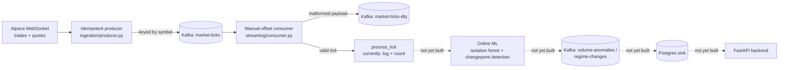

# StreamAlpha — Real-Time Market Anomaly Detection via Kafka

Real-time market anomaly detection via Kafka. Online/streaming ML (incremental isolation forest, Bayesian changepoint detection) flags volume spikes and volatility regime shifts, built around an explicit exactly-once processing story. Extends [alpha-signal-lab](https://github.com/hkbuttar/alpha-signal-lab)'s equity universe with a true event-streaming architecture in place of that project's daily batch loop.

> **Status**: In progress. Ingestion and consumer correctness (manual offsets, DLQ routing and replay) are built and verified against a live Alpaca paper account and a local Kafka broker. Online ML, storage, backend, chaos testing, and deployment are not yet built — see [Current Status](#current-status) for what's real versus what's planned.

---

## Table of Contents
1. [Motivation](#motivation)
2. [System Architecture](#system-architecture)
3. [Data](#data)
4. [Correctness Design](#correctness-design)
5. [Repository Structure](#repository-structure)
6. [Setup & Usage](#setup--usage)
7. [Current Status](#current-status)
8. [Future Work](#future-work)

---

## Motivation

[alpha-signal-lab](https://github.com/hkbuttar/alpha-signal-lab) is a daily-batch factor research and paper-trading platform: it pulls end-of-day bars, scores signals once a day, and rebalances on that cadence. That's the right cadence for a slow-moving factor strategy, but it can't see anything that happens *within* a day — a volume spike, a sudden volatility regime shift, a quote that's gone stale — because by the time the next batch run picks up the data, the moment that mattered is long past.

StreamAlpha asks a narrower, different question against the same universe: can genuinely real-time, tick-by-tick data support anomaly detection that has to update online, one event at a time, with no batch window to fall back on? That constraint changes almost everything about the engineering, not just the modeling: ingestion has to handle a WebSocket that can drop mid-stream, a consumer has to survive a crash without silently losing or duplicating a tick, and the ML models (once built) have to update incrementally instead of retraining from a stable historical window. This project is the event-streaming counterpart to alpha-signal-lab's batch pipeline, sharing its universe but built around a completely different set of correctness problems.

---

## System Architecture



Solid boxes and arrows are built and verified; dashed ones are planned (see [Current Status](#current-status)). Every stage that exists is a separate module so ingestion, consumption, and (eventually) modeling can be tested and reasoned about independently.

---

## Data

- **Universe**: the same equity universe as alpha-signal-lab, imported directly from `config.universe` (see [Correctness Design](#correctness-design) for how) rather than copied — 50 large-cap US names across Technology, Healthcare, Financials, and Energy. (alpha-signal-lab's own README describes this as a 49-name universe after dropping Hess post-acquisition; the `config/universe.py` file actually installed and imported here currently contains 50 tickers with no Hess entry, so that number is stated as observed rather than reconciled against alpha-signal-lab's docs.)
- **Feed**: Alpaca's real-time WebSocket (`wss://stream.data.alpaca.markets/v2/iex`), trades and quotes, not the REST API — a REST poll can't see intra-second activity, which is the whole reason this project exists alongside alpha-signal-lab's batch pipeline.
- **Feed tier caveat, found empirically**: Alpaca does not publish the free/IEX plan's maximum simultaneous symbol subscription count anywhere in its docs (checked the streaming docs, market data FAQ, and pricing page directly). Subscribing to too many symbols at once fails with `symbol limit exceeded (405)`. Confirmed against a real account: 30 symbols fails, 15 succeeds; the exact ceiling in between hasn't been pinned down further since it isn't needed to be precise, just under the real limit. `ALPACA_MAX_SYMBOLS` in `.env` controls how many of the 50 universe tickers get subscribed, so this is tunable per account rather than hardcoded.
- **No historical backfill**: unlike alpha-signal-lab, there's no cached local dataset here — every tick is either live from the WebSocket or replayed from Kafka/the DLQ. A gap in the WebSocket connection is a real, permanent data gap (see below), not something a re-download can fix later.

---

## Correctness Design

Exactly-once processing is treated as a deliberate design decision made of three independent legs, not a single setting to turn on. Two are built so far:

**1. Idempotent producer (`ingestion/producer.py`).** `enable.idempotence=true` plus `acks=all` means librdkafka tags every message with a producer ID and a per-partition sequence number, so a retried send after a broker timeout or leader failover is recognized and deduplicated by the broker rather than appended twice. This only protects against *producer-side retries* — it says nothing about a consumer reprocessing a message after a crash, which is the next leg.

**2. Manual offset commit + dead-letter queue (`streaming/consumer.py`, `streaming/dlq.py`).** Auto-commit is disabled. An offset is committed only after whatever that message required is durably done — either the tick was successfully handed to a processing callback, or (for malformed/schema-drifted payloads) it was durably written to `market-ticks-dlq`. Two distinct failure categories are handled two different ways on purpose:
  - A payload that fails schema validation (`streaming/schema.py`) is bad data, not a bug in the consumer — it's routed to the DLQ instead of crashing the process or being silently dropped, with `streaming/dlq_tools.py` available to inspect and replay those records once the upstream issue is fixed.
  - An exception raised by the processing callback itself is treated as a real bug, not bad data, and is deliberately **not** caught: it propagates and crashes the consumer, leaving the offset uncommitted so the same message is redelivered and reprocessed on restart. Catching and swallowing it here would trade that guarantee away for uptime, silently.

**3. Idempotent storage sink** — not built yet. This is what will close the loop (upsert on ticker + timestamp + anomaly type), so a DLQ replay or a consumer restart can't produce duplicate rows.

**Cross-repo dependency.** `config.universe` is imported from alpha-signal-lab as a live editable install (`-e ../alpha-signal-lab` in `requirements.txt`), not copied, so the two projects can't silently drift apart on what "the universe" means. This only works with both repos checked out as sibling directories locally; it will need to become a git dependency or a vendored copy once this is deployed somewhere that only clones streamalpha.

**Reconnect/backoff, found through real debugging rather than assumed.** alpaca-py's own WebSocket client retries a dropped connection with zero backoff, including on persistent auth failures — confirmed live against a real account, where a stale connection from a killed test process caused a `connection limit exceeded` error that the SDK retried dozens of times in under a second. `ingestion/run.py` supervises the connection from a watchdog thread and applies its own exponential backoff. Getting the shutdown path right took three attempts: a plain blocking `thread.join()` silently swallowed `Ctrl+C` (confirmed by attaching `lldb` to a genuinely hung process), a polled version of the same `try`/`except KeyboardInterrupt` pattern still didn't reliably fire, and the version that actually works uses a custom `signal.signal()` handler setting a flag that's checked cooperatively — verified to respond within about 50ms where the exception-based approach had been observed hanging for 10+ seconds. This is covered by regression tests in `tests/ingestion/test_run.py` specifically because it looked fixed twice before it actually was.

**The same shutdown bug class, again, in a completely different C extension.** `streaming/consumer.py`'s `consumer.poll()` blocks inside librdkafka's C code even though it's called with a 1-second timeout — attaching `lldb` to a hung consumer process showed the main thread stuck in `cnd_timedwait_abs` well over a minute after `Ctrl+C`, the identical shape of the `ingestion/run.py` bug but in a totally unrelated library. That's no longer treated as a one-off: the rule adopted project-wide is that no blocking call into a C extension, timeout or not, can be trusted to let a pending signal through promptly, and every consume loop uses the same custom-`signal.signal()`-plus-cooperative-flag pattern instead of relying on `KeyboardInterrupt`.

**`streaming/dlq_tools.py`'s "when is a drain done" logic took three attempts, all caught live.** First: stop on the very first empty poll — wrong, `inspect` reported "0 records" against a topic `kafka-console-consumer` could read from immediately afterward, because a fresh consumer group's rebalance takes a few seconds and an empty poll during that window looks identical to no data. Second: require several consecutive empty polls before giving up — better, but still wrong on this topic's 3 partitions (`inspect` found 7 records while a `replay` run moments later found 20 more). Third attempt precomputed an exact count via `get_watermark_offsets` on the same consumer about to fetch from those partitions — this one didn't just under- or over-count, it got a real `replay` run stuck indefinitely one message from the end, a message independently confirmed present and readable the whole time. The actual fix was to stop reinventing exhaustion detection and use the Kafka client's own mechanism for it: `enable.partition.eof`, which makes `poll()` return a `PARTITION_EOF` pseudo-message exactly when a partition is drained. Re-verified live afterward: a `replay` run that had been stuck for minutes on the last message completed in 3.2 seconds once this landed.

---

## Repository Structure

```
streamalpha/
├── ingestion/          # Alpaca WebSocket client, idempotent Kafka producer
├── streaming/           # Kafka consumer: manual offsets, DLQ routing/replay
├── storage/              # empty -- Postgres sink not yet built
├── backend/               # empty -- FastAPI backend not yet built
├── chaos/                  # empty -- load/fault-injection tests not yet built
├── notebooks/               # empty -- research notebook not yet added
├── tests/
│   ├── ingestion/             # producer, Alpaca stream wiring, reconnect/shutdown logic
│   └── streaming/               # schema validation, consumer, DLQ (52 tests total)
├── docker-compose.yml            # local Kafka (KRaft mode), topic bootstrap
├── requirements.txt
└── .env.example
```

---

## Setup & Usage

```bash
# one-time setup (assumes alpha-signal-lab is checked out as a sibling directory)
cd streamalpha
python3.11 -m venv .venv
source .venv/bin/activate
pip install -r requirements.txt        # must run from streamalpha/, see requirements.txt
cp .env.example .env                   # fill in ALPACA_API_KEY / ALPACA_SECRET_KEY

# local Kafka
docker compose up -d kafka
docker compose up kafka-init           # creates market-ticks, market-ticks-dlq,
                                        # volume-anomalies, regime-changes; exits when done

# run the test suite
pytest tests/ -v

# ingest live ticks into Kafka (Ctrl+C to stop cleanly)
python -m ingestion

# consume ticks, validate, route bad payloads to the DLQ (separate terminal)
python -m streaming

# inspect or replay DLQ'd messages after fixing whatever caused them
python -m streaming.dlq_tools inspect --limit 20
python -m streaming.dlq_tools replay --limit 20

docker compose down
```

---

## Current Status

**Built and verified:**
- Local Kafka (KRaft mode) via Docker Compose, with `market-ticks`, `market-ticks-dlq`, `volume-anomalies`, and `regime-changes` topics provisioned on startup.
- Alpaca WebSocket ingestion with an idempotent producer, verified end-to-end against a live paper account — real trade and quote data confirmed flowing into `market-ticks`, correctly keyed by symbol.
- Reconnect/backoff handling for the WebSocket, including a documented, real (not hypothetical) SDK gap around zero-delay retries on persistent connection failures.
- A manual-offset, DLQ-routing consumer with schema validation, verified live: a malformed message is routed to `market-ticks-dlq` and its offset committed only after that write is durable; a valid tick is processed and committed; a processing exception is confirmed to leave the offset uncommitted.
- `streaming/dlq_tools.py`, verified live: `inspect` correctly lists a DLQ'd record without consuming it destructively, and `replay` re-publishes it to `market-ticks` and is idempotent across repeated runs.
- Clean shutdown (`SIGINT`/`SIGTERM`) verified on both the ingestion and consumer processes against real Kafka/Alpaca connections, not just in tests.
- 52 unit tests across ingestion and streaming (offline, no live Kafka/Alpaca required to run), including regression coverage for the shutdown-signal bug class specifically because it looked fixed more than once before it actually was.

**Not yet built:** online ML (incremental isolation forest, Bayesian changepoint detection), the Postgres storage sink and its idempotent upsert, the cross-reference against alpha-signal-lab's factor moves, the FastAPI backend, the chaos/load testing harness, the dashboard, and deployment. `process_tick` in `streaming/run_consumer.py` currently just logs and counts ticks — it exists to exercise the consumer's correctness pattern end-to-end, not to detect anything yet.

---

## Future Work

- Replace the placeholder tick processor with online anomaly detection: a per-ticker incremental isolation forest (or `river`'s `HalfSpaceTrees`) for volume/price outliers, and Bayesian online changepoint detection on rolling realized volatility for regime shifts — a deliberately different failure mode from a single-tick outlier.
- Persist model state periodically so a consumer restart resumes learning instead of starting cold.
- Idempotent Postgres sink (upsert on ticker + timestamp + anomaly type), completing the exactly-once story end to end.
- Cross-reference detected anomalies against days alpha-signal-lab's factors moved sharply, reported honestly regardless of outcome.
- FastAPI backend exposing live ticks, anomalies, and system health (consumer lag, DLQ depth, model freshness per ticker).
- Chaos testing: burst load, a kill-and-restart test proving no ticks are lost or duplicated, and a WebSocket disconnect test.
- A frontend dashboard, managed Kafka + hosting for deployment, and a full write-up of results, limitations, and assumptions once there's something real to report.
